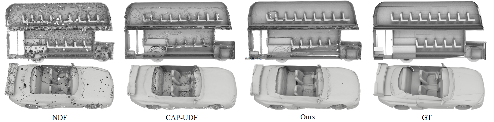
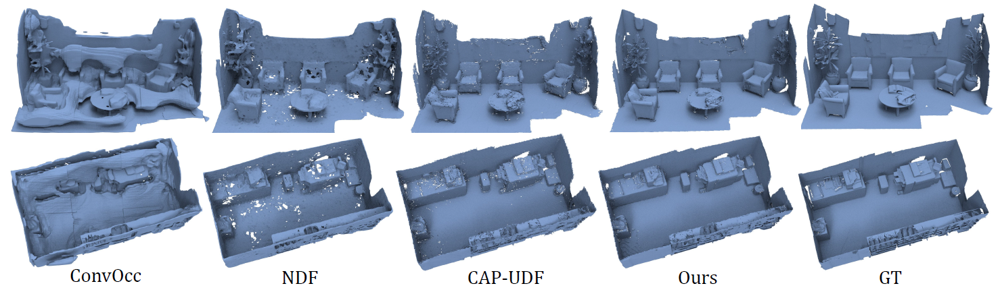
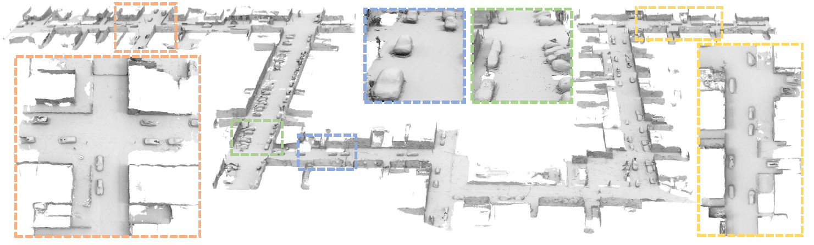
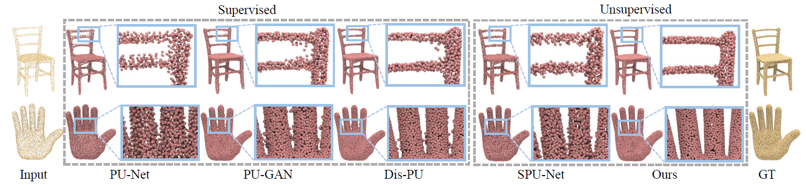
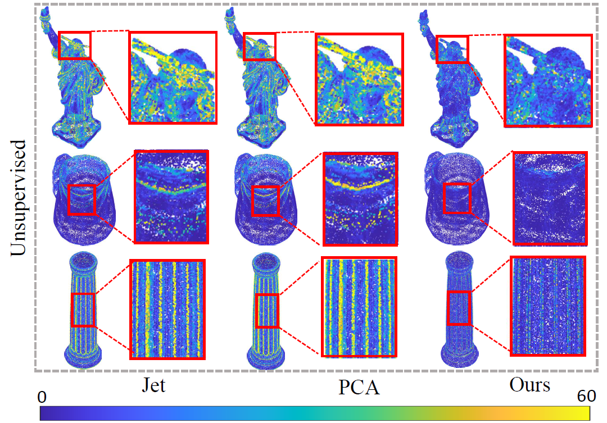

<p align="center">

  <h1 align="center">Learning a More Continuous Zero Level Set in Unsigned Distance Fields through Level Set Projection</h1>
  <p align="center">
    <a href="https://junshengzhou.github.io/"><strong>Junsheng Zhou*</strong></a>
    ·
    <a href="https://mabaorui.github.io/"><strong>Baorui Ma*</strong></a>
    ·
    <a href="https://scholar.google.com/citations?user=wynhSuQAAAAJ&hl=zh-CN&oi=sra"><strong>Shujuan Li</strong></a>
    ·
    <a href="https://yushen-liu.github.io/"><strong>Yu-Shen Liu</strong></a>
    ·
    <a href="https://h312h.github.io/"><strong>Zhizhong Han</strong></a>

  </p>
  <p align="center"><strong>(* Equal Contribution)</strong></p>
  <h2 align="center">ICCV 2023</h2>
  <!-- <h3 align="center"><a>Paper</a> | <a href="https://junshengzhou.github.io/CAP-UDF">Project Page</a></h3> -->
  <div align="center"></div>
</p>

We will release the code of the paper <a href="https://arxiv.org/abs/2308.11441">Learning a More Continuous Zero Level Set in Unsigned Distance Fields through Level Set Projection</a> in this repository.

## Citation
If you find our code or paper useful, please consider citing

    @inproceedings{zhou2023levelset,
    title={Learning a More Continuous Zero Level Set in Unsigned Distance Fields through Level Set Projection},
    author={Zhou, Junsheng and Ma, Baorui and Li, Shujuan and Liu, Yu-Shen and Han, Zhizhong},
    booktitle={Proceedings of the IEEE/CVF international conference on computer vision},
    year={2023}
    }


## Reconstruction Results
### ShapeNetCars
<p align="center">
  
</p>

### 3DScenes
<p align="center">
  
</p>

### KITTI
<p align="center">
  
</p>

## Point Upsampling Results
<p align="center">
  
</p>

## Point Normal Estimation Results
<p align="center">
  
</p>


## Related works
Please also check out the following works that inspire us a lot:
* [Junsheng Zhou et al. - Learning consistency-aware unsigned distance functions progressively from raw point clouds. (NeurIPS2022)](https://junshengzhou.github.io/CAP-UDF/)
* [Baorui Ma et al. - Neural-Pull: Learning Signed Distance Functions from Point Clouds by Learning to Pull Space onto Surfaces (ICML2021)](https://github.com/mabaorui/NeuralPull-Pytorch)
* [Baorui Ma et al. - Surface Reconstruction from Point Clouds by Learning Predictive Context Priors (CVPR2022)](https://mabaorui.github.io/PredictableContextPrior_page/)
* [Baorui Ma et al. - Reconstructing Surfaces for Sparse Point Clouds with On-Surface Priors (CVPR2022)](https://mabaorui.github.io/-OnSurfacePrior_project_page/)

## Installation
Our code is implemented in Python 3.8, PyTorch 1.11.0 and CUDA 11.3.
- Install python Dependencies
```bash
conda create -n levelsetudf python=3.8
conda activate levelsetudf
conda install pytorch torchvision torchaudio cudatoolkit=11.3 -c pytorch
pip install tqdm pyhocon==0.3.57 trimesh PyMCubes scipy point_cloud_utils
```
- Compile C++ extensions
```
cd extensions/chamfer_dist
python setup.py install
```

## Train
Coming soom
